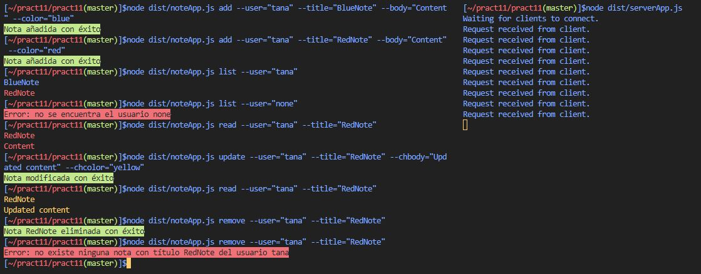
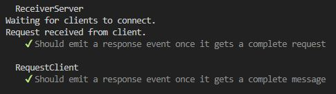

# Práctica 11 - Cliente y servidor para una aplicación de procesamiento de notas de texto
[](https://coveralls.io/github/ULL-ESIT-INF-DSI-2122/ull-esit-inf-dsi-21-22-prct11-async-sockets-tanafc?branch=master)
## Objetivos
A partir de la aplicación de procesamiento de notas llevada a cabo en la Práctica 9, se propone el desarrollo de un servidor y un cliente haciendo uso de los sockets proporcionados por el módulo `net` de Node.js.

Todo el código desarrollado se encuentra bajo el directorio `src` del proyecto. Los tests implementados para los mismos se encuentran en `tests`.

Los requisitos de la aplicación son similares a los de la práctica anteriormente desarrollada, esto es, la aplicación permitirá añadir una nota, modificarla, eliminarla, listar las notas de un usuario y leer una nota concreta.

En este caso, será el servidor el encargado de hacer persistente la lista de notas de cada usuario. Así, todas las notas se almacenarán en un fichero JSON bajo el directorio del usuario correspondiente. Asimismo, será el servidor el encargado de cargar las notas de los diferentes ficheros, con el objetivo de procesar las peticiones del cliente y devolver las respuestas apropiadas.

El usuario interactirará con la aplicación a través de la línea de comandos del cliente, que será el encargado de enviar las peticiones al servidor. Los diferentes comandos se gestionarán mediante el paquete `yargs`.

De esta manera se muestra a continuación la implementación del código desarrollado.

### Implementación

La aplicación de un servidor para el manejo de los ficheros y el procesamiento de las peticiones del cliente se ha llevado a cabo mediante la creación de una clase `receiverServer`. Además, el cliente permitirá enviar las peticiones con su correspondiente clase `requestClient`. Ambas clases emitirán eventos propios cuando se reciba la petición del cliente, y cuando el cliente reciba la respuesta del servidor.

El intercambio de mensajes entre el servidor y cliente se realiza mediante dos tipos de datos definidos en el fichero `messageTypes`, donde existe un tipo `RequestType` para el envío de peticiones del cliente, y `ResponseType` para las respuestas de servidor hacia el cliente.

```ts
export type RequestType = {
  type: 'add' | 'update' | 'remove' | 'read' | 'list';
  user: string;
  title?: string;
  body?: string;
  color?: string;
  chtitle?: string;
  chbody?: string;
  chcolor?: string;
}

export type ResponseType = {
  type: 'add' | 'update' | 'remove' | 'read' | 'list';
  success: boolean;
  description?: string;
  notes?: Note[];
}
```

Las `RequestType` indicarán el tipo de petición que es, el usuario a revisar sus notas, y parámetros opcionales como el título de la nota, cuerpo, color, y otros atributos que, en caso de definirse junto con el tipo `update`, permitirán modificar campos específicos de la nota.

`ResponseType`, además de indicar el tipo de petición al que la respuesta se atribuye, tiene un campo `success` para indicar si la petición se ha llevado a cabo de manera correcta, además de un parámetro opcional `description` para que el servidor envíe una explicación si la operación no se ha llevado a cabo de manera correcta. El campo `notes` devolverá al cliente un grupo de notas en caso de que este último las haya solicitado.

Se procede así a la explicación del código del cliente y servidor.

### Implementación del Servidor

Para la recepción de peticiones del servidor, como se comentó anteriormente, se ha implementado una clase `ReceiveServer`, que extiende de la clase `EventEmitter` con el objetivo de emitir un evento cada vez que se recibe dicha petición, para que el código del servidor pueda procesar la respuesta.
```ts
export class ReceiverServer extends EventEmitter {
  private server: net.Server;

  constructor(port: number) {
    super();
    this.server = net.createServer({allowHalfOpen: true}, (connection) => {
      console.log('Request received from client.');
      // Stores the whole data.
      let wholeRequest = '';
      connection.on('data', (requestChunk) => {
        wholeRequest += requestChunk;
      });
      // When the client ends sending the request.
      connection.on('end', () => {
        const request: RequestType = JSON.parse(wholeRequest);
        this.emit('request', request, connection);
      });
    }).listen(port, () => {
      console.log('Waiting for clients to connect.');
    });
  }

  public sendResponse(response: ResponseType, socket: net.Socket) {
    socket.write(JSON.stringify(response));
    socket.end();
  }

  public closeServer() {
    this.server.close();
  }
}
```

De esta manera, la clase implementa un atributo `server` donde se almacenará el objeto devuelto por `net.createServer`. Esto permitirá más adelante cerrar el servidor a través del método `closeServer`. En el constructor, el servidor se abre con la opción `{allowHalfOpen: true}` para que el servidor pueda responder al cliente aunque éste haya cerrado su lado del socket. De esta manera, el manejador de `createServer` se ejecutará cuando un cliente se conecte. Ante la recepción de una petición, se irá almacenando en la variable `wholeRequest`, hasta que el servidor envíe un evento de tipo `end`. Esto significará que se ha terminado de enviar la petición, y por lo tanto, la clase emitirá un evento `request`, que devolverá como parámetros la petición parseada y el socket de la conexión.

De esta manera el código del servidor, que se encuentra en el fichero `serverApp`, ejecutará las acciones correspondientes cuando el servidor emita un evento `request`.

```ts
const notesDataBase = new NotesFileSystem();
const server = new ReceiverServer(60200);

// The server attends the clients`s petitions
server.on('request', (request, socket) => {
  const userNotes = notesDataBase.getUserNotes(request.user);
  let response: ResponseType = {
    type: 'add',
    success: false,
  };

  switch (request.type) {
    case 'add':
      if (isColor(request.color)) {
        const noteToAdd = new Note(request.title, request.body, request.color as ColorChoice);
        if (notesDataBase.addNewNote(request.user, noteToAdd) === -1) {
          response = {
            type: 'add',
            success: false,
            description: `Error, nota ${request.title} ya existente`,
          };
        } else {
          response = {
            type: 'add',
            success: true,
            description: 'Nota añadida con éxito',
          };
        }
      } else {
        response = {
          type: 'add',
          success: false,
          description: `Error: el color ${request.color} no está disponible`,
        };
      }
      break;

    case 'update':
      if (typeof userNotes === 'undefined') {
        response = {
          type: 'update',
          success: false,
          description: `Error: no se encuentra el usuario ${request.user}`,
        };
      } else {
        let note = userNotes.getNote(request.title);
        if (typeof note === 'undefined') {
          response = {
            type: 'update',
            success: false,
            description: `Error: no existe nota ${request.title} del usuario ${request.user}`,
          };
        } else {
          notesDataBase.deleteNote(request.user, request.title);
          if (typeof request.chtitle !== 'undefined') {
            note.setTitle(request.chtitle);
          }
          if (typeof request.chbody !== 'undefined') {
            note.setBody(request.chbody);
          }
          if ((typeof request.chcolor !== 'undefined') && (isColor(request.chcolor))) {
            note.setColor(request.chcolor as ColorChoice);
          }
          if (notesDataBase.addNewNote(request.user, note) === 0) {
            response = {
              type: 'update',
              success: true,
              description: `Nota modificada con éxito`,
            };
          } else {
            response = {
              type: 'update',
              success: false,
              description: `Error: error inesperado`,
            };
          }
        }
      }
      break;

    case 'remove':
      if (notesDataBase.deleteNote(request.user, request.title) === -1) {
        response = {
          type: 'remove',
          success: false,
          description: `Error: no existe ninguna nota con título ${request.title} del usuario ${request.user}`,
        };
      } else {
        response = {
          type: 'remove',
          success: true,
          description: `Nota ${request.title} eliminada con éxito`,
        };
      }
      break;

    case 'read':
      if (typeof userNotes === 'undefined') {
        response = {
          type: 'read',
          success: false,
          description: `Error: no se encuentra el usuario ${request.user}`,
        };
      } else {
        const note = userNotes.getNote(request.title);
        if (typeof note === 'undefined') {
          response = {
            type: 'read',
            success: false,
            description: `Error: no existe nota ${request.title} del usuario ${request.user}`,
          };
        } else {
          response = {
            type: 'read',
            success: true,
            notes: [note],
          };
        }
      }
      break;

    case 'list':
      if (typeof userNotes !== "undefined") {
        response = {
          type: 'list',
          success: true,
          notes: userNotes.getUserNotes(),
        };
      } else {
        response = {
          type: 'list',
          success: false,
          description: `Error: no se encuentra el usuario ${request.user}`,
        };
      }
      break;
  }
  // The server sends the response to the client
  server.sendResponse(response, socket);
});
```

Así, el manejador del evento `request` procesará la petición recibida, obteniendo las notas del usuario correspondiente, y rellenando, en cada opción, la respuesta adecuada. Por ejemplo, en el caso de la petición sea de tipo `add`, creará una nueva nota y la añadirá mediante el método `addNewNote` de la clase `NotesFileSystem` implementada en la práctica anterior. Si la acción se realiza exitosamente, la respuesta tendrá el atributo `success` a `true` y enviará una descripción con los resultados de la operación. En caso de fallo, por ejemplo, porque ya existe una nota con el mismo nombre, el campo `success` se pondrá a `false` y la descripción describirá este hecho.

De manera similar, en otros tipos de petición, los campos de la respuesta se rellenarán de manera correspondiente. En los casos de los tipos `read` y `list`, la respuesta contendrá en el campo de `notes` las notas que el cliente habrá solicitado.

Por último, el código del servidor envía la respuesta mediante el método `sendResponse` de la clase `ReceiverServer`, la cual enviará la respuesta y cerrará el socket de la conexión.

### Implementación del Cliente

Para realizar las peticiones al servidor, una clase `RequestClient` permitirá realizar una conexión al servidor al servidor y emitir eventos `response` cuando le el servidor envíe la respuesta.
```ts
/**
 * Class that emits an event when a server replies to the request.
 * Defines methods to request a petition to the server.
 */
export class RequestClient extends EventEmitter {
  constructor(private connection: net.Socket) {
    super();
    // Stores the whole data send by the server.
    let wholeResponse = '';
    connection.on('data', (responseChunk) => {
      wholeResponse += responseChunk;
    });
    // When the server ends sending the reply.
    connection.on('end', () => {
      const response: ResponseType = JSON.parse(wholeResponse);
      this.emit('response', response);
    });
  }

  public makeRequest(request: RequestType) {
    this.connection.write(JSON.stringify(request));
    this.connection.end();
  }
}
```

De esta manera, un objeto de la clase `RequestClient` se conectará al puerto que se le proporcione como parámetro en el constructor, e instanciará un manejador para la recepción de respuestas del servidor, que irá almacenando el mensaje en `wholeResponse`. Cuando reciba un evento `end`, el servidor habrá terminado de mandar su respuesta y, en consecuencia, el cliente parseará la respuesta y emitirá un evento `response`, para que el programa del cliente se encargue de procesar la misma.

Mediante el uso del método `makeRequest` de esta clase, se podrán realizar peticiones al servidor, cerrando el socket una vez se envíe la misma.

Así, el programa cliente, alojado en el fichero `noteApp.ts` es el siguiente:
```ts
// The clients allows to make petitions to the server
const client = new RequestClient(connect({port: 60200}));

// Manager when the server responds to a request
client.on('response', (serverResponse) => {
  const response: ResponseType = serverResponse;
  if (response.success === false) {
    console.log(chalk.red.inverse(response.description));
  } else {
    switch (response.type) {
      case 'list':
        const notesToList = response.notes as unknown as NoteInterface[];
        notesToList.forEach((note) => {
          const color = note.color;
          switch (color) {
            case 'blue':
              console.log(chalk.blue(note.title));
              break;
            case 'red':
              console.log(chalk.red(note.title));
              break;
            case 'yellow':
              console.log(chalk.yellow(note.title));
              break;
            case 'green':
              console.log(chalk.green(note.title));
              break;
          }
        });
        break;

      case 'read':
        const notesToRead = response.notes as unknown as NoteInterface[];
        notesToRead.forEach((note) => {
          switch (note.color) {
            case 'blue':
              console.log(chalk.blue(note.title));
              console.log(chalk.blue(note.body));
              break;
            case 'red':
              console.log(chalk.red(note.title));
              console.log(chalk.red(note.body));
              break;
            case 'yellow':
              console.log(chalk.yellow(note.title));
              console.log(chalk.yellow(note.body));
              break;
            case 'green':
              console.log(chalk.green(note.title));
              console.log(chalk.green(note.body));
              break;
          }
        });
        break;

      default:
        console.log(chalk.green.inverse(response.description));
    }
  }
});
```

De esta manera, se instancia un objeto cliente de la clase `RequestClient`. Con ello, cuando se emita un evento de tipo `response`, el programa analizará la respuesta del servidor. En primer lugar, se analizará el atributo `success` de la respuesta para determinar si la acción se ha llevado a cabo correctamente, imprimiendo por consola la descripción proporcionada por el servidor en caso contrario. 

Una vez asegurada que la petición se ha procesado correctamente, se analiza su tipo. Si es de tipo `list`, se imprime por pantalla los títulos de las notas devueltos por el servidor en el parámetro `notes`, con el color de la nota que corresponda. De manera similar para el tipo `read`, la nota devuelta se imprimirá del color indicado en la misma. Un apunte importante es la conversión de tipo realizada en la siguiente línea:
```ts
const notesToRead = response.notes as unknown as NoteInterface[];
```
Uno de los problemas encontrados al intentar acceder al atributo de las notas, es que no se podían acceder a los métodos getters de la clase `Note` cuando se obtenían las mismas con `JSON.parse()`. Su uso resultaba en un error en tiempo de ejecución, donde se indicaba que los métodos no existían. Por ello, se ha llevado a cabo la creación de una interfaz de notas, donde se especifican los atributos de `title`, `body` y `color`:
```ts
export interface NoteInterface {
  title: string;
  body: string;
  color: ColorChoice;
}
```

De esta manera, como el objeto devuelto por response.notes es de tipo `Note`, primero se realiza su conversión a `unknown`, para seguidamente pasar a tipo `NoteInterface` y así, poder acceder de manera directa a sus atributos.

Por último, para el resto de tipos de respuesta, en los casos de `add`, `update` y `remove`, simplemente se imprimirá el mensaje informativo del servidor en el parámetro `description` en color verde.

Para el procesamiento de los parámetros por línea de comandos, como se comentó anteriormente, se realiza mediante el paquete `yargs`. Al igual que la práctica 9, 
se definirán manejadores para cada tipo de petición correspondiente, que requerirá de sus parámetros correspondientes.
```ts
// Add command to add a new user`s note
yargs.command({
  command: 'add',
  describe: 'Add a new note',
  builder: {
    user: {
      describe: 'Name of the user',
      demandOption: true,
      type: 'string',
    },
    title: {
      describe: 'Note title',
      demandOption: true,
      type: 'string',
    },
    body: {
      describe: 'Note body',
      demandOption: true,
      type: 'string',
    },
    color: {
      describe: 'Note color',
      demandOption: true,
      type: 'string',
    },
  },
  handler(argv) {
    if ((typeof argv.title === 'string') && (typeof argv.body === 'string') &&
        (typeof argv.color === 'string' && (typeof argv.user === 'string'))) {
      // Petition to server
      client.makeRequest({
        type: 'add',
        user: argv.user,
        title: argv.title,
        body: argv.body,
        color: argv.color,
      });
    }
  },
});
```
Un ejemplo del mismo es la petición de tipo `add`, donde el usuario deberá proporcionar los parámetros de `user`, `title`, `body` y `color`. Una vez proporcionados, el manejador simplemente deberá realizar la petición al cliente mediante el método `makeRequest` con los atributos correspondientes, dejando al servidor con la responsabilidad de procesar los mismos e informar si son correctos. En este caso, el servidor podría hacer que, en caso de que ya hubiera una nota del usuario con el mismo título, informara de la incidencia en la respuesta.

De esta manera se realizaría la interacción entre el programa cliente y servidor. Un ejemplo de la ejecución de ambos sería el siguiente:



### Pruebas
Se han implementado algunas pruebas para el código del cliente y servidor. En especial, se han puesto en funcionamiento las emisiones de eventos tipo `request` de la clase `ReceiverServer` y de tipo `response` de la clase `RequestClient`. De esta manera, se podrá asegurar el correcto funcionamiento de las mismas, observando como ante la recepción de una petición por parte del cliente, éste emite el correspondiente evento:
```ts
describe('ReceiverServer', () => {
  it('Should emit a response event once it gets a complete request', (done) => {
    const server = new ReceiverServer(60100);
    const client = new RequestClient(net.connect({port: 60100}));

    server.on('request', (request) => {
      server.closeServer();
      expect(request).to.be.eql({
        "type": "add",
        "user": "john",
        "title": "aTitle",
        "body": "aBody",
        "color": "blue",
      });
      done();
    });

    client.makeRequest({
      type: 'add',
      user: 'john',
      title: 'aTitle',
      body: 'aBody',
      color: 'blue',
    });
  });
});
```

Y de la misma manera, cuando el cliente reciba una respuesta del servidor, éste emitirá el evento `response` junto a sus datos:
```ts
describe('RequestClient', () => {
  it('Should emit a response event once it gets a complete message', (done) => {
    const socket = new net.Socket();
    const client = new RequestClient(socket);

    client.on('response', (response) => {
      expect(response).to.be.eql({"type": "add", "success": true});
      done();
    });

    socket.emit('data', '{"type": "add"');
    socket.emit('data', ', "success": true}');
    socket.emit('end');
  });
});
```

La ejecución de las pruebas permitirá observar su correcta implementación:



### Conclusión
De esta manera, se ha llevado a cabo la implementación de un programa cliente, que permite realizar las peticiones a un servidor, cuyo programa permitirá recibir las mismas, gestionar el procesamiento de las notas, y enviar una respuesta al cliente.

Se ha puesto en práctica el conocimiento sobre la clase `EventEmitter`, para que las clases puedieran emitir sus propios eventos, así como del módulo `net` de `fs` para el manejo de las conexiones entre un servidor local y un cliente, mediante el uso de objetos `Server` y `Socket`. Con ello, se han implementado los manejadores correspondientes para el manejo de los eventos de la conexión en el socket, puediendo desarrollar así la aplicación cliente-servidor.
